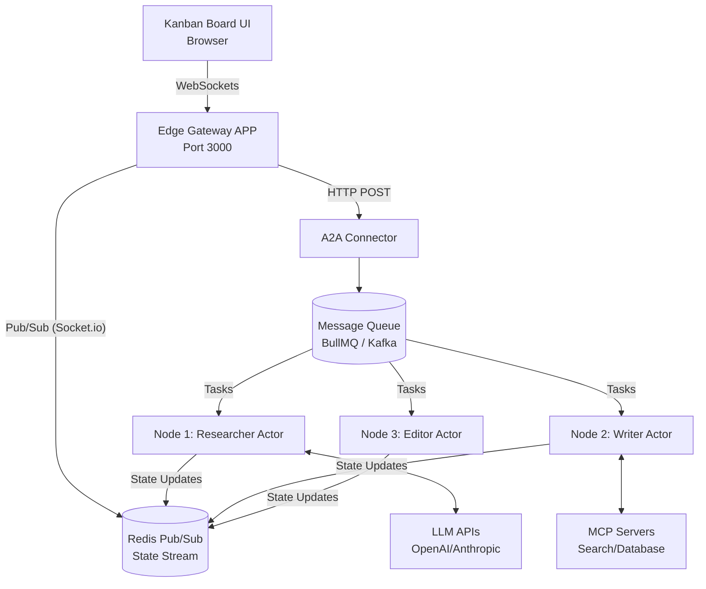
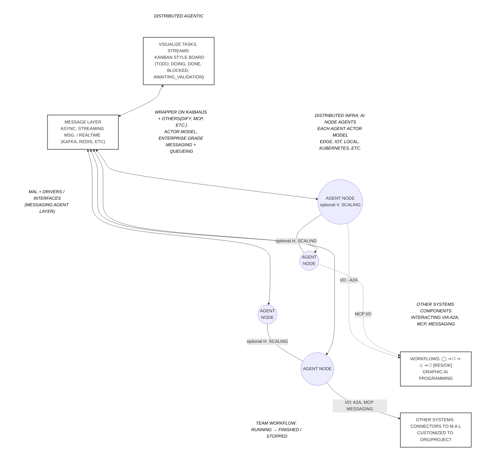
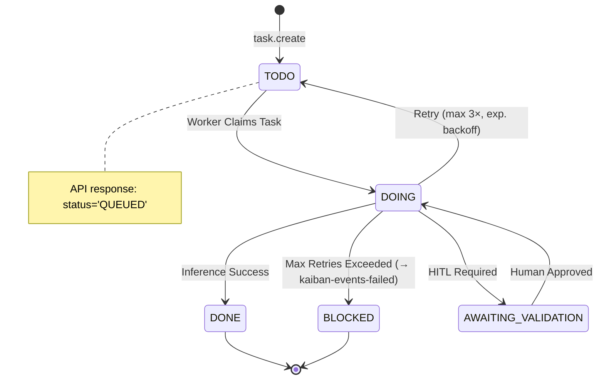

# kaiban-distributed — Multi-Agent Distributed AI System

> Distributed horizontally-scalable Actor-Model multi-agents runtime based on [KaibanJS](https://kaibanjs.com).
>
> Run multiple AI agents teams across independently deployed Node.js processes, with real-time visibility and multi-agent orchestration via Redis/Kafka pub/sub, A2A and MCP.
>
> Integrates with existing KaibanJS agents, external agentic systems, or any service that can publish via A2A / MCP / Redis / Kafka — connecting them into actor-model team flows or peer-to-peer coordination, scalable from local usage to enterprise grade systems.
>
> For running the example system see [EXAMPLES.md](EXAMPLES.md).
> For more documentation and system build flow with [GABBE](https://github.com/andreibesleaga/GABBE), check files in [docs/](docs/).
>

[](#testing)
[](#testing)
[](#security--compliance)
[](tsconfig.json)
[](package.json)
[](LICENSE)

---

## Summary — Use in Another Project (30 seconds)

```bash
# 1. Clone and install
git clone https://github.com/andreibesleaga/kaiban-distributed
cd kaiban-distributed && npm install

# 2. Configure
cp .env.example .env
# Edit .env — add OPENROUTER_API_KEY or OPENAI_API_KEY + AGENT_IDS

# 3. Start the full blog-team demo (Docker Compose, Orchestrator, UI Preview, and Monitor)
./scripts/blog-team.sh start

# 4. Stop everything cleanly when done
./scripts/blog-team.sh stop
```

To wire your own KaibanJS agent into a distributed worker node:

```typescript
import { BullMQDriver } from './src/infrastructure/messaging/bullmq-driver';
import { AgentActor } from './src/application/actor/AgentActor';
import { createKaibanTaskHandler } from './src/infrastructure/kaibanjs/kaiban-agent-bridge';
import { AgentStatePublisher } from './src/adapters/state/agent-state-publisher';

const driver = new BullMQDriver({ connection: { host: 'localhost', port: 6379 } });

const statePublisher = new AgentStatePublisher('redis://localhost:6379', {
  agentId: 'my-agent', name: 'Ada', role: 'Analyst',
});

const handler = statePublisher.wrapHandler(
  createKaibanTaskHandler({
    name: 'Ada', role: 'Analyst',
    goal: 'Analyse datasets and produce structured summaries',
    background: 'Expert in data analysis and statistics',
    llmConfig: { provider: 'openai', model: 'gpt-4o-mini', apiKey: process.env.OPENAI_API_KEY },
  }, driver)
);

const actor = new AgentActor('my-agent', driver, 'kaiban-agents-my-agent', handler);
await actor.start();
statePublisher.publishIdle();  // board shows agent as IDLE within 15s
```

---

## Architecture

```
┌──────────────────────────────────────────────────────────────────────┐
│  Board Viewer (browser)                                              │
│  examples/blog-team/viewer/board.html                                │
│  Socket.io client ──────────────────────────────────────────────┐    │
└─────────────────────────────────────────────────────────────────│────┘
                                                                  │ ws
┌─────────────────────────────────────────────────────────────────▼────┐
│  Edge Gateway  (port 3000)                                           │
│  GatewayApp:   GET /health · GET /.well-known/agent-card.json        │
│                POST /a2a/rpc  (JSON-RPC 2.0 → routes to queue)       │
│  SocketGateway: subscribes Redis kaiban-state-events → Socket.io     │
└──────────────────────────────────────────────────────────────────────┘
         │ BullMQ / Kafka task queues        │ Redis Pub/Sub
         │ kaiban-agents-{agentId}           │ kaiban-state-events
┌────────▼──────────┐  ┌────────▼────────┐  ┌────────▼───────────────┐
│ Worker: researcher│  │ Worker: writer  │  │ Worker: editor         │
│  AgentActor       │  │  AgentActor     │  │  AgentActor            │
│  KaibanAgentBridge│  │  KaibanBridge   │  │  KaibanBridge          │
│  → Agent.workOn() │  │  → Agent.work() │  │  → Agent.work()        │
│  AgentState       │  │  AgentState     │  │  AgentState            │
│  Publisher        │  │  Publisher      │  │  Publisher             │
│  (ioredis pub/sub)│  │  (ioredis)      │  │  (ioredis)             │
└───────────────────┘  └─────────────────┘  └────────────────────────┘
         │                      │                        │
         └──────────────────────┴────────────────────────┘
                                │
                    ┌───────────▼────────────┐
                    │  Redis 7 (always)      │
                    │  BullMQ queues +       │
                    │  kaiban-state-events   │
                    └────────────────────────┘

  Optional: Kafka (MESSAGING_DRIVER=kafka)
┌─────────────────────────────────────────────────────────────────────┐
│  Zookeeper + Kafka — high-throughput alternative to BullMQ          │
│  KafkaDriver implements IMessagingDriver (swap via env var)         │
│  State broadcast still uses Redis Pub/Sub (SocketGateway)           │
└─────────────────────────────────────────────────────────────────────┘
```


### High-Level Distributed Topology Example



### Complete Architectural Schema (Digitalized from Sketch)



### Task State Machine (The Worker Lifecycle)



---


### Components

| Component | Location | Purpose |
|-----------|----------|---------|
| `AgentActor` | `src/application/actor/` | Actor: subscribes to queue, processes tasks with retry (3×) + DLQ, optional firewall + circuit breaker |
| `KaibanAgentBridge` | `src/infrastructure/kaibanjs/` | Wraps KaibanJS `Agent`; calls `agent.workOnTask()`; optional JIT token provider |
| `KaibanTeamBridge` | `src/infrastructure/kaibanjs/` | Wraps KaibanJS `Team` with distributed state sync |
| `AgentStatePublisher` | `src/adapters/state/` | Publishes IDLE/EXECUTING/DONE/ERROR to Redis Pub/Sub; 15s heartbeat |
| `BullMQDriver` | `src/infrastructure/messaging/` | Redis-backed job queue (default); optional TLS; no colon queue names |
| `KafkaDriver` | `src/infrastructure/messaging/` | Kafka-backed messaging; optional SSL/mTLS; unique consumer group per worker role |
| `DistributedStateMiddleware` | `src/adapters/state/` | Intercepts Zustand store `setState()` and publishes deltas to messaging layer |
| `GatewayApp` | `src/adapters/gateway/` | Express HTTP: `/health`, `/.well-known/agent-card.json`, `/a2a/rpc` |
| `SocketGateway` | `src/adapters/gateway/` | Socket.io server + Redis pub/sub subscriber; broadcasts `state:update` to board |
| `A2AConnector` | `src/infrastructure/federation/` | JSON-RPC 2.0; `tasks.create` publishes to messaging layer |
| `MCPFederationClient` | `src/infrastructure/federation/` | Connects to any MCP tool server via stdio transport |
| `HeuristicFirewall` | `src/infrastructure/security/` | Regex-based prompt injection detection (ASI01); opt-in via `SEMANTIC_FIREWALL_ENABLED` |
| `EnvTokenProvider` | `src/infrastructure/security/` | JIT token abstraction (ASI03); reads API keys from env vars; opt-in via `JIT_TOKENS_ENABLED` |
| `SlidingWindowBreaker` | `src/infrastructure/security/` | Sliding-window circuit breaker (ASI10); opt-in via `CIRCUIT_BREAKER_ENABLED` |
| `OrchestratorStatePublisher` | `examples/blog-team/orchestrator.ts` | Owns workflow lifecycle (RUNNING→FINISHED/STOPPED/AWAITING) |
| `CompletionRouter` | `examples/blog-team/orchestrator.ts` | Single BullMQ/Kafka subscriber dispatching completion events by `taskId` |

---

## Prerequisites

- **Node.js** ≥ 22
- **Docker** + **Docker Compose** (for Redis, Kafka, and multi-node demo)
- **LLM API key** — OpenAI (`OPENAI_API_KEY`), OpenRouter (`OPENROUTER_API_KEY`), other compatible APIs

---

## Quick Start

### 1. Install

```bash
git clone https://github.com/andreibesleaga/kaiban-distributed
cd kaiban-distributed
npm install
```

### 2. Configure

```bash
cp .env.example .env
```

Edit `.env` — choose your LLM provider:

```bash
# Standard OpenAI
OPENAI_API_KEY=sk-...
LLM_MODEL=gpt-4o-mini

# OpenRouter (https://openrouter.ai/keys)
OPENROUTER_API_KEY=sk-or-v1-...
LLM_MODEL=meta-llama/llama-3.1-8b-instruct:free   # free tier

# Required — which agents this node serves
AGENT_IDS=researcher,writer,editor
```

### 3. Start infrastructure

```bash
docker compose up -d redis
```

### 4. Build and run gateway

```bash
npm run build
AGENT_IDS=gateway PORT=3000 node dist/src/main/index.js
```

### 5. Verify

```bash
curl http://localhost:3000/health
# → {"data":{"status":"ok","timestamp":"..."}}

curl http://localhost:3000/.well-known/agent-card.json
# → {"name":"kaiban-worker","version":"1.0.0","capabilities":[...]}
```

---

## Individual Node Pattern

Mirrors the [kaibanjs-node-demo](https://github.com/kaibanjs/kaibanjs-node-demo) pattern — each agent runs as an independent process:

```typescript
// my-agent-node.ts
import 'dotenv/config';
import { BullMQDriver } from './src/infrastructure/messaging/bullmq-driver';
import { AgentActor } from './src/application/actor/AgentActor';
import { createKaibanTaskHandler } from './src/infrastructure/kaibanjs/kaiban-agent-bridge';
import { AgentStatePublisher } from './src/adapters/state/agent-state-publisher';

const REDIS_URL = process.env['REDIS_URL'] ?? 'redis://localhost:6379';
const redisUrl = new URL(REDIS_URL);

const driver = new BullMQDriver({
  connection: { host: redisUrl.hostname, port: parseInt(redisUrl.port || '6379', 10) },
});

const statePublisher = new AgentStatePublisher(REDIS_URL, {
  agentId: 'researcher', name: 'Ava', role: 'News Researcher',
});

const handler = statePublisher.wrapHandler(
  createKaibanTaskHandler({
    name: 'Ava',
    role: 'News Researcher',
    goal: 'Find and summarize the latest news on a given topic',
    background: 'Expert data analyst with deep research experience',
    llmConfig: {
      provider: 'openai',
      model: process.env['LLM_MODEL'] ?? 'gpt-4o-mini',
      apiKey: process.env['OPENAI_API_KEY'],
    },
  }, driver)
);

const actor = new AgentActor('researcher', driver, 'kaiban-agents-researcher', handler);
await actor.start();
statePublisher.publishIdle();  // board shows Ava as IDLE within 15s
console.log('[Researcher] Ava started');

process.on('SIGTERM', async () => {
  await actor.stop();
  await driver.disconnect();
  await statePublisher.disconnect();
});
```

```bash
# Terminal 1 — researcher
OPENAI_API_KEY=sk-... node dist/examples/blog-team/researcher-node.js

# Terminal 2 — writer
OPENAI_API_KEY=sk-... node dist/examples/blog-team/writer-node.js

# Terminal 3 — send a task via A2A
curl -X POST http://localhost:3000/a2a/rpc \
  -H 'Content-Type: application/json' \
  -d '{"jsonrpc":"2.0","id":1,"method":"tasks.create","params":{"agentId":"researcher","instruction":"Research the latest AI agent frameworks in 2025","expectedOutput":"A concise summary"}}'
```

---

## Integrating with kaiban-board

[kaiban-board](https://github.com/kaibanjs/kaiban-board) is a React component that visualises KaibanJS team execution as a live Kanban board.

### How state flows to the board

```
Worker nodes (each):
  AgentStatePublisher.publishIdle()     → Redis PUBLISH kaiban-state-events { agents: [IDLE] }
  AgentStatePublisher.wrapHandler()     → EXECUTING → DONE/ERROR → Redis PUBLISH
  15-second heartbeat                   → re-publishes current agent status
  (heartbeat NEVER sets teamWorkflowStatus — only the orchestrator does)

Orchestrator:
  workflowStarted()     → { teamWorkflowStatus: 'RUNNING', agents: all IDLE }
  awaitingHITL(...)     → { tasks: [AWAITING_VALIDATION] }
  workflowFinished(...) → { teamWorkflowStatus: 'FINISHED', all tasks: DONE }
  workflowStopped(...)  → { teamWorkflowStatus: 'STOPPED', tasks: BLOCKED }

SocketGateway:
  subscribes Redis kaiban-state-events → emits Socket.io 'state:update' to board
```

### Board state lifecycle

`teamWorkflowStatus` values (set by the orchestrator only):

| `teamWorkflowStatus` | Board banner | Badge |
|---|---|---|
| `RUNNING` | none | 🔵 blue |
| `FINISHED` | ✅ **WORKFLOW COMPLETE** (green glow) | 🟢 green |
| `STOPPED` | ⏹ **WORKFLOW ENDED** (grey) | ⚫ grey |

> The ⏸ **HUMAN DECISION REQUIRED** (orange pulse) banner is shown when any task has status `AWAITING_VALIDATION` — this is triggered by task state, not by `teamWorkflowStatus`.

Task card states:
- `TODO` — 📋 pending (initial state)
- `DOING` — 🔵 blue left border + pulse dot
- `DONE` — 🟢 green
- `AWAITING_VALIDATION` — 🟠 orange pulsing glow + `⏸ HUMAN DECISION` badge + HITL banner
- `BLOCKED` — 🔴 red glow + `⛔ ERROR` badge + red error banner with message

### Option A: Static HTML viewer (zero setup)

Open [`examples/blog-team/viewer/board.html`](examples/blog-team/viewer/board.html) directly in a browser.
Auto-connects to `http://localhost:3000`. All three agents (Ava, Kai, Morgan) appear as IDLE within 15 seconds.

Event stream shows typed, colour-coded entries:
- `WORKFLOW` badge — workflow status transitions
- `AGENT` badge — IDLE → EXECUTING → IDLE per agent
- `TASK` badge — task status with result preview

### Option B: Custom Socket.io client

```javascript
import { io } from 'socket.io-client';
const socket = io('http://localhost:3000');
const agentMap = new Map();
const taskMap  = new Map();

socket.on('state:update', (delta) => {
  // IMPORTANT: merge by ID — each worker publishes only its own slice
  if (delta.agents) {
    for (const a of delta.agents)
      agentMap.set(a.agentId, { ...agentMap.get(a.agentId), ...a });
  }
  if (delta.tasks) {
    for (const t of delta.tasks)
      taskMap.set(t.taskId, { ...taskMap.get(t.taskId), ...t });
  }
});
```

### Option C: KaibanTeamBridge (local Team + distributed workers)

```typescript
import { Agent, Task } from 'kaibanjs';
import { BullMQDriver } from './src/infrastructure/messaging/bullmq-driver';
import { KaibanTeamBridge } from './src/infrastructure/kaibanjs/kaiban-team-bridge';

const ava = new Agent({ name: 'Ava', role: 'Researcher', goal: '...', background: '...' });
const kai = new Agent({ name: 'Kai', role: 'Writer',     goal: '...', background: '...' });

const driver = new BullMQDriver({ connection: { host: 'localhost', port: 6379 } });

const bridge = new KaibanTeamBridge({
  name: 'Blog Team',
  agents: [ava, kai],
  tasks: [
    new Task({ description: 'Research {topic}', expectedOutput: 'Summary', agent: ava }),
    new Task({ description: 'Write blog',       expectedOutput: 'Blog post', agent: kai }),
  ],
}, driver);

const result = await bridge.start({ topic: 'AI agents 2025' });
// State propagates: Redis Pub/Sub → SocketGateway → Socket.io → board
```

---

## A2A Protocol (Agent-to-Agent)

The Edge Gateway implements the [A2A protocol](https://google-deepmind.github.io/a2a/) for interoperability with other AI systems.

### Agent Card

```bash
curl http://localhost:3000/.well-known/agent-card.json
```

```json
{
  "name": "kaiban-worker",
  "version": "1.0.0",
  "description": "Kaiban distributed agent worker node",
  "capabilities": ["tasks.create", "tasks.get", "agent.status"],
  "endpoints": { "rpc": "/a2a/rpc" }
}
```

### RPC Methods

| Method | Params | Returns |
|--------|--------|---------|
| `tasks.create` | `{ agentId, instruction, expectedOutput, inputs?, context? }` | `{ taskId, status: 'QUEUED', agentId }` |
| `tasks.get` | `{ taskId }` | `{ taskId, status }` |
| `agent.status` | — | `{ status: 'IDLE', agentId }` |

```bash
curl -X POST http://localhost:3000/a2a/rpc \
  -H 'Content-Type: application/json' \
  -d '{
    "jsonrpc": "2.0", "id": 1,
    "method": "tasks.create",
    "params": {
      "agentId": "researcher",
      "instruction": "Research quantum computing breakthroughs in 2025",
      "expectedOutput": "A 300-word technical summary",
      "inputs": { "topic": "quantum computing" }
    }
  }'
```

---

## MCP Integration

Attach any [Model Context Protocol](https://modelcontextprotocol.io) tool server to your agents:

```typescript
import { MCPFederationClient } from './src/infrastructure/federation/mcp-client';

const mcp = new MCPFederationClient('npx', ['-y', '@modelcontextprotocol/server-brave-search']);
await mcp.connect();
const tools = await mcp.listTools();
const result = await mcp.callTool('brave_web_search', { query: 'AI agents 2025' });
await mcp.disconnect();
```

MCP servers for Redis and Kafka enable AI agents to intercept and query live data streams:

| Server | Purpose |
|--------|---------|
| [`mcp-redis`](https://github.com/redis/mcp-redis) | Query `kaiban-state-events` pub/sub, streams (`XREAD`), vector search |
| Confluent MCP | Flink SQL queries over live Kafka topics (Confluent Cloud) |
| [`tuannvm/kafka-mcp-server`](https://github.com/tuannvm/kafka-mcp-server) | Consume Kafka messages at specific offsets (self-hosted) |

```json
// claude_desktop_config.json
{
  "redis": {
    "command": "npx",
    "args": ["-y", "@modelcontextprotocol/server-redis", "--url", "redis://localhost:6379"]
  }
}
```

---

## Messaging Drivers

### BullMQ (Default — Redis)

Best for: development, small-to-medium scale, reliable delivery, job history.

```bash
MESSAGING_DRIVER=bullmq
REDIS_URL=redis://localhost:6379
```

> **Important:** BullMQ v5 rejects queue names containing colons. All internal channels use dashes:
> `kaiban-agents-researcher`, `kaiban-events-completed`, `kaiban-events-failed`, `kaiban-state-events`

### Kafka (High-Throughput)

Best for: large scale, event streaming, message replay, multi-datacenter.

```bash
MESSAGING_DRIVER=kafka
KAFKA_BROKERS=localhost:9092
KAFKA_CLIENT_ID=kaiban-worker
KAFKA_GROUP_ID=kaiban-group
```

**Kafka consumer group isolation** — unique group suffix per component:

| Component | Consumer Group |
|-----------|---------------|
| researcher worker | `kaiban-group-researcher` |
| writer worker | `kaiban-group-writer` |
| editor worker | `kaiban-group-editor` |
| orchestrator (completed events) | `kaiban-group-orchestrator-completed` |
| orchestrator (failed/DLQ events) | `kaiban-group-orchestrator-failed` |

> Task queues use Kafka topics. State broadcast (`kaiban-state-events`) always uses Redis Pub/Sub — `SocketGateway` reads directly from Redis regardless of `MESSAGING_DRIVER`.

### Driver factory (for custom node code)

```typescript
// examples/blog-team/driver-factory.ts
import { createDriver, getDriverType } from './driver-factory';
const driver = createDriver('researcher');   // BullMQ or Kafka based on MESSAGING_DRIVER env
```

### Switching at runtime

Set `MESSAGING_DRIVER=kafka` (or `bullmq`) — the `IMessagingDriver` interface is the abstraction. Worker code is identical for both drivers.

---

## API Reference

### HTTP Endpoints

| Method | Path | Description |
|--------|------|-------------|
| `GET` | `/health` | `{ data: { status: 'ok', timestamp } }` |
| `GET` | `/.well-known/agent-card.json` | A2A agent capabilities |
| `POST` | `/a2a/rpc` | JSON-RPC 2.0: `tasks.create`, `tasks.get`, `agent.status` |

All responses: `{ data, meta, errors }` envelope.

### Socket.io Events

| Event | Direction | Payload |
|-------|-----------|---------|
| `state:update` | server → client | `StateDelta` (PII-sanitized) |

### Internal Channel Names

| Channel | Driver | Purpose |
|---------|--------|---------|
| `kaiban-agents-{agentId}` | BullMQ / Kafka | Task inbox per agent |
| `kaiban-events-completed` | BullMQ / Kafka | Successful task results |
| `kaiban-events-failed` | BullMQ / Kafka | DLQ after 3 retry failures |
| `kaiban-state-events` | Redis Pub/Sub | Agent/workflow state → board |

---

## Configuration Reference

| Variable | Default | Required | Description |
|----------|---------|----------|-------------|
| `AGENT_IDS` | — | **Yes** | Comma-separated agent IDs this node serves |
| `REDIS_URL` | `redis://localhost:6379` | No | Redis connection URL |
| `MESSAGING_DRIVER` | `bullmq` | No | `bullmq` or `kafka` |
| `KAFKA_BROKERS` | `localhost:9092` | Kafka only | Comma-separated broker addresses |
| `KAFKA_CLIENT_ID` | `kaiban-worker` | No | Kafka client identifier |
| `KAFKA_GROUP_ID` | `kaiban-group` | No | Kafka consumer group base ID |
| `PORT` | `3000` | No | HTTP + WebSocket port |
| `SERVICE_NAME` | `kaiban-worker` | No | Name in telemetry and agent card |
| `OPENAI_API_KEY` | — | For agents | Standard OpenAI API key |
| `OPENROUTER_API_KEY` | — | For agents | OpenRouter key (auto-configures base URL) |
| `OPENAI_BASE_URL` | — | Optional | Custom OpenAI-compatible endpoint |
| `LLM_MODEL` | `gpt-4o-mini` | No | Model (for OpenRouter: `meta-llama/llama-3.1-8b-instruct:free`) |
| `OTEL_EXPORTER_OTLP_ENDPOINT` | — | No | OpenTelemetry OTLP endpoint (else console) |

#### Security (all opt-in, disabled by default)

| Variable | Default | Description |
|----------|---------|-------------|
| `REDIS_TLS_CA` / `REDIS_TLS_CERT` / `REDIS_TLS_KEY` | — | Paths to Redis mTLS certificates |
| `KAFKA_SSL_CA` / `KAFKA_SSL_CERT` / `KAFKA_SSL_KEY` | — | Paths to Kafka mTLS certificates |
| `TLS_REJECT_UNAUTHORIZED` | `true` | Set `false` for self-signed certs in staging |
| `SEMANTIC_FIREWALL_ENABLED` | `false` | Enable heuristic prompt injection firewall |
| `SEMANTIC_FIREWALL_LLM_URL` | — | Optional local LLM endpoint for deep analysis |
| `JIT_TOKENS_ENABLED` | `false` | Enable JIT token provider for LLM API keys |
| `CIRCUIT_BREAKER_ENABLED` | `false` | Enable sliding-window circuit breaker |
| `CIRCUIT_BREAKER_THRESHOLD` | `10` | Failures before breaker trips |
| `CIRCUIT_BREAKER_WINDOW_MS` | `60000` | Sliding window duration (ms) |

---

## Security & Compliance

A security audit was performed against the **OWASP Top 10 for Agentic AI (2026)** and **OWASP Top 10 for LLM Applications (2025)**. See [SECURITY_AUDIT.md](docs/security/SECURITY_AUDIT.md) for the full report.

### Security Features (opt-in via env flags)

| Feature | Component | OWASP | Description |
|---------|-----------|-------|-------------|
| **Semantic Firewall** | `HeuristicFirewall` | ASI01 | Regex-based prompt injection detection; blocks goal-hijacking attempts before they reach LLMs |
| **mTLS** | `KafkaDriver` / `BullMQDriver` | ASI07 | TLS/mTLS for all messaging connections; self-signed certs via `scripts/generate-dev-certs.sh` |
| **JIT Token Provider** | `EnvTokenProvider` | ASI03 | Abstracts API key retrieval; future implementations can fetch from Vault or Secrets Manager |
| **Circuit Breaker** | `SlidingWindowBreaker` | ASI10 | Trips after configurable failures in a sliding window; auto-recovers; emits OTLP anomaly events |

All features are **disabled by default**. Enable individually via environment variables (`SEMANTIC_FIREWALL_ENABLED`, `JIT_TOKENS_ENABLED`, `CIRCUIT_BREAKER_ENABLED`). When disabled, the system behaves identically to the pre-security baseline.

### Compliance Controls

| Control | Implementation |
|---------|----------------|
| **GDPR — PII in logs** | Agent IDs SHA-256 hashed (8-char prefix) via `sanitizeId()` |
| **GDPR — State deltas** | `sanitizeDelta()` strips: `email`, `name`, `phone`, `ip`, `password`, `token`, `secret`, `ssn`, `dob` |
| **GDPR — Data minimisation** | `result` field capped at 800 chars in state events |
| **SOC2 — Non-root container** | Dockerfile: `USER kaiban` (non-root) |
| **SOC2 — Secrets** | All secrets via env vars; `.env` gitignored; `.env.example` has no real values |
| **ISO 27001 — Encryption** | mTLS for Redis/Kafka; HTTPS for LLM APIs; `scripts/generate-dev-certs.sh` for staging |
| **Observability** | OpenTelemetry auto-instrumentation; W3C `traceparent` propagated across BullMQ/Kafka hops; `recordAnomalyEvent()` for circuit breaker events |
| **Known CVE** | `kaibanjs ≥ 0.3.0` has 6 moderate CVEs via `@langchain/community` transitive deps; unfixable without `kaibanjs@0.0.1` downgrade (breaking) |

---

## Development

### Commands

```bash
npm run build          # tsc → dist/src/ and dist/examples/
npm run dev            # node dist/src/main/index.js (build first)
npm run test           # 340 unit tests (no external deps)
npm run test:coverage  # 100% coverage — all metrics
npm run test:e2e       # BullMQ E2E (Docker Redis auto-started)
npm run test:e2e:kafka # Kafka E2E (Docker Kafka + Zookeeper required)
npm run lint           # ESLint + complexity ≤10 — 0 errors target
npm run typecheck      # tsc --noEmit — strict mode
npm run format         # prettier --write
npm run lint:arch      # madge --circular src/ — no circular imports
```

### Testing

| Suite | Command | Count | Infrastructure |
|-------|---------|-------|----------------|
| Unit | `npm test` | 340 tests, 36 files | None (all mocked) |
| BullMQ E2E | `npm run test:e2e` | 7 tests | Docker Redis (auto-managed by globalSetup) |
| Kafka E2E | `npm run test:e2e:kafka` | 2 tests | Docker Kafka + Zookeeper |

### Coverage

| Metric | Result |
|--------|--------|
| Statements | **100%** |
| Branches | **100%** |
| Functions | **100%** |
| Lines | **100%** |

### Project Structure

```
kaiban-distributed/
├── src/
│   ├── domain/
│   │   ├── entities/          # DistributedTask, DistributedAgentState (with type guards)
│   │   ├── errors/            # DomainError, TaskNotFoundError, MessagingError, ...
│   │   ├── result.ts          # Result<T,E> — ok(), err(), isOk(), isErr()
│   │   └── security/          # Domain interfaces for security components
│   │       ├── semantic-firewall.ts  # ISemanticFirewall — evaluates payloads for injection
│   │       ├── token-provider.ts     # ITokenProvider — JIT token abstraction
│   │       └── circuit-breaker.ts    # ICircuitBreaker — success/failure tracking
│   ├── application/
│   │   └── actor/
│   │       └── AgentActor.ts  # Core: retry×3 + exp backoff, DLQ, firewall, circuit breaker
│   ├── adapters/
│   │   ├── gateway/
│   │   │   ├── GatewayApp.ts       # Express: /health, agent-card, /a2a/rpc, 404
│   │   │   └── SocketGateway.ts    # Socket.io + Redis pub/sub → board
│   │   └── state/
│   │       ├── distributedMiddleware.ts    # Intercepts Zustand setState → messaging
│   │       └── agent-state-publisher.ts   # Direct Redis pub/sub; 15s heartbeat; lifecycle
│   ├── infrastructure/
│   │   ├── messaging/
│   │   │   ├── interfaces.ts       # IMessagingDriver (publish, subscribe, unsubscribe, disconnect)
│   │   │   ├── bullmq-driver.ts    # BullMQ Worker + Queue; optional TLS; no colons in queue names
│   │   │   └── kafka-driver.ts     # KafkaJS producer + consumer; optional SSL/mTLS
│   │   ├── federation/
│   │   │   ├── a2a-connector.ts    # JSON-RPC 2.0; tasks.create routes to messaging layer
│   │   │   └── mcp-client.ts       # MCPFederationClient via stdio transport
│   │   ├── kaibanjs/
│   │   │   ├── kaiban-agent-bridge.ts  # createKaibanTaskHandler; JIT tokens; error detection
│   │   │   └── kaiban-team-bridge.ts   # KaibanTeamBridge with DistributedStateMiddleware
│   │   ├── security/              # Security infrastructure implementations
│   │   │   ├── heuristic-firewall.ts    # Regex prompt injection detection (10+ patterns)
│   │   │   ├── env-token-provider.ts    # Env-var backed JIT token provider
│   │   │   └── sliding-window-breaker.ts # Configurable sliding-window circuit breaker
│   │   └── telemetry/
│   │       ├── telemetry.ts        # initTelemetry(); recordAnomalyEvent(); OTLP or console
│   │       └── TraceContext.ts     # injectTraceContext / extractTraceContext (W3C)
│   └── main/
│       ├── index.ts    # Composition root: wires all layers + security deps, starts HTTP + actors
│       └── config.ts   # loadConfig(); TLS config; security feature flags
├── tests/
│   ├── unit/           # 340 unit tests — mirrors src/ structure, 100% coverage
│   └── e2e/
│       ├── distributed-execution.test.ts  # BullMQ: execution, fault tolerance, state sync
│       ├── a2a-protocol.test.ts           # HTTP gateway + A2A
│       ├── kafka-driver.test.ts           # Kafka pub/sub round-trip
│       └── setup/
│           ├── globalSetup.ts             # Docker Redis auto-start; resilient to existing Redis
│           └── kafkaSetup.ts              # Docker Kafka + Zookeeper + Redis auto-start
├── examples/
│   └── blog-team/                         # Three-agent editorial pipeline
│       ├── team-config.ts                 # Agent configs (Ava, Kai, Morgan) + LLM factory
│       ├── driver-factory.ts              # createDriver(suffix) — BullMQ or Kafka from env
│       ├── researcher-node.ts             # Ava worker entry point
│       ├── writer-node.ts                 # Kai worker entry point
│       ├── editor-node.ts                 # Morgan worker entry point
│       ├── orchestrator.ts                # Event-driven pipeline + HITL terminal
│       ├── docker-compose.yml             # BullMQ: redis + gateway + 3 workers
│       ├── docker-compose.kafka.yml       # Kafka: zookeeper + kafka + redis + gateway + 3 workers
│       └── viewer/
│           └── board.html                 # Live Kanban board — open in browser, no build
├── scripts/
│   ├── monitor.sh                         # Real-time terminal dashboard (all streams)
│   └── generate-dev-certs.sh              # Self-signed CA + server/client certs for mTLS
├── agents/                                # GABBE kit: guides, skills, memory, CONSTITUTION.md
├── docker-compose.yml                     # Full root stack (Redis + Kafka + single worker)
├── Dockerfile                             # Multi-stage: builder (npm ci + tsc) → runner (non-root)
└── .env.example                           # All env vars documented with examples
```

### Architecture Decisions

| Decision | Rationale |
|----------|-----------|
| BullMQ as default | Lower ops overhead for dev; Kafka requires Zookeeper |
| No colons in BullMQ queue names | BullMQ v5 rejects colons; all internal names use dashes |
| `IMessagingDriver` abstraction | Swap BullMQ ↔ Kafka via `MESSAGING_DRIVER`; worker code unchanged |
| Workers never set `teamWorkflowStatus` | Only orchestrator owns workflow lifecycle; prevents heartbeats overriding FINISHED |
| `AgentStatePublisher` uses ioredis directly | SocketGateway reads Redis pub/sub; BullMQ queues are separate concerns |
| 15-second heartbeat in `AgentStatePublisher` | Redis pub/sub is fire-and-forget; late-connecting boards see state within 15s |
| Two KafkaDriver instances in `CompletionRouter` | KafkaJS `consumer.run()` cannot subscribe to new topics after start |
| `initializeAgentLLM()` in agent bridge | KaibanJS requires `agentInstance.initialize(store, env)` to bootstrap LLM; no Team needed |
| KaibanJS error results throw, not return | `agent.workOnTask()` returns `{ error: '...' }` on LLM failure; throwing enables AgentActor retry |
| `forceFinalAnswer: true` on editor | Free 8B models reach max iterations without structured output |
| SHA-256 hash prefix for agent IDs | 8-char prefix preserves debuggability while preventing PII leakage |
| `globalSetup` catches Redis port conflict | E2E tests are resilient when Redis is already running from another compose stack |
| `healthcheck: disable: true` on workers | Workers are not HTTP servers; Dockerfile HEALTHCHECK checks port 3000 which is gateway-only |

---

## Managing the Example & Real-Time Monitor

### Unified Start/Stop Script

The easiest way to run the full `blog-team` example is using the orchestration script. It handles Docker Compose, the API Gateway, worker nodes, the orchestrator, and automatically opens the live board in your browser. It then launches the real-time monitor.

```bash
# BullMQ/Redis — local orchestrator (default)
./scripts/blog-team.sh start
./scripts/blog-team.sh stop

# Kafka — local orchestrator
./scripts/blog-team.sh start --kafka
./scripts/blog-team.sh stop --kafka

# BullMQ/Redis — fully containerised (orchestrator runs in Docker, HITL via attached terminal)
./scripts/blog-team.sh start --docker
./scripts/blog-team.sh stop --docker

# Kafka — fully containerised (flags are order-independent)
./scripts/blog-team.sh start --kafka --docker
./scripts/blog-team.sh stop --kafka --docker
```

> **`--docker` mode** runs every component — including the orchestrator — as a Docker container. The orchestrator service (`docker compose run --rm orchestrator`) attaches your terminal for interactive HITL decisions [1/2/3/4]. Inside Docker it connects to gateway/Redis/Kafka via service-name hostnames. Without `--docker`, the orchestrator runs locally via `npx ts-node` (requires Node.js + project deps installed).

### Standalone Real-Time Monitor

If you started components manually, you can run the terminal monitor on its own. It automatically detects the `MESSAGING_DRIVER` (BullMQ/Redis or Kafka).

```bash
./scripts/monitor.sh

# With options:
REDIS_URL=redis://localhost:6379 \
COMPOSE_FILE=examples/blog-team/docker-compose.yml \
MESSAGING_DRIVER=bullmq \
LOG_TAIL=200 QUEUE_POLL_SEC=3 \
  ./scripts/monitor.sh
```

| Stream | Description |
|--------|-------------|
| `[workflow]` | Status transitions: RUNNING → FINISHED / STOPPED |
| `[agents]` | IDLE · EXECUTING (green) · THINKING (blue) · ERROR (red) |
| `[tasks]` | DOING · DONE (green) · BLOCKED (red) · AWAITING_VALIDATION (yellow) |
| `[logs]` researcher/writer/editor/gateway | Per-container process logs |
| `[queue]` | BullMQ queue depths polled every 5s |
| `[!ERR]` | All errors across all containers (red highlight) |

### Common Issues

| Error | Cause | Fix |
|-------|-------|-----|
| `401 User not found` | Invalid OpenRouter API key | Get valid key at https://openrouter.ai/keys |
| `404 MODEL_NOT_FOUND` / data policy | Free model requires privacy opt-in | Enable https://openrouter.ai/settings/privacy or use paid model |
| `No endpoints found matching your data policy` | Free tier data-sharing required | Enable https://openrouter.ai/settings/privacy |
| `LLM instance is not initialized` | KaibanJS `llmInstance` not bootstrapped | Fixed — `initializeAgentLLM()` calls `agentInstance.initialize(null, env)` |
| `Queue name cannot contain :` | Colon in BullMQ queue name | Fixed — all internal queues use dashes |
| `Agent failed: Max retries exceeded` | LLM API error | Check API key and model name |
| `Task incomplete: max iterations` | Small model can't produce structured output | Fixed — `forceFinalAnswer: true` on editor; increase `maxIterations` |
| `network not found` on docker compose up | Stale network from previous compose stack | `docker compose down --remove-orphans && docker network prune --force` |
| Worker shows `unhealthy` | Dockerfile HEALTHCHECK pings port 3000; workers aren't HTTP servers | Fixed — `healthcheck: disable: true` in worker services |
| Kafka: orchestrator timeout on writing/revision | Second `subscribe()` after `consumer.run()` silently dropped | Fixed — TWO KafkaDriver instances with distinct consumer groups |
| `Timeout waiting for research` | Task failed (DLQ) but orchestrator not notified | Fixed — `CompletionRouter` subscribes to both completed AND failed |
| BullMQ E2E: port 6379 already in use | Another compose stack has Redis | Fixed — `globalSetup` catches and skips; or stop other stack first |
| `No OTEL endpoint` warning on startup | `OTEL_EXPORTER_OTLP_ENDPOINT` not set — using verbose ConsoleSpanExporter | Expected in dev; set `OTEL_EXPORTER_OTLP_ENDPOINT` for production |

---

## Project Context

Built with [**GABBE Agentic Engineering Kit**](https://github.com/andreibesleaga/GABBE) following the SDD/TDD lifecycle:

| Phase | Deliverable | Status |
|-------|-------------|--------|
| S01 | PRD.md — requirements | ✅ |
| S02 | PLAN.md — C4 architecture diagrams | ✅ |
| S03 | SPEC.md — domain models, API schemas | ✅ |
| S04 | TASKS.md — decomposition | ✅ |
| S05 | Core implementation (6 modules) | ✅ |
| S06 | Unit test suite — 100% coverage | ✅ |
| S07 | KaibanJS integration, blog-team pipeline, Kafka, README | ✅ |
| S08 | Security remediation — mTLS, semantic firewall, JIT tokens, circuit breakers | ✅ |


---

## License

GPL-3.0 ©2026 [Andrei Besleaga](https://github.com/andreibesleaga)
