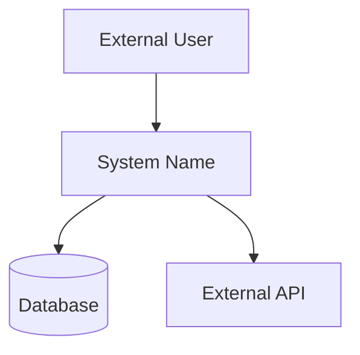
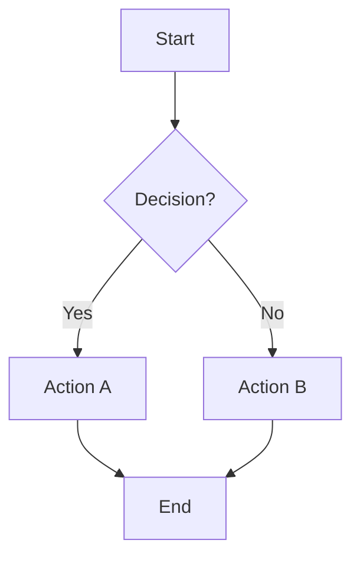
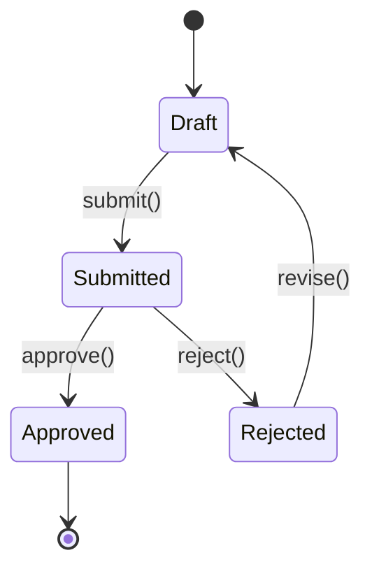
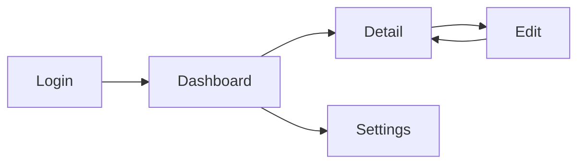
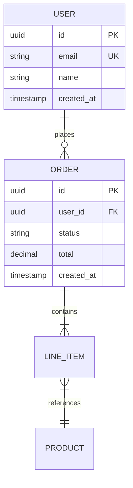
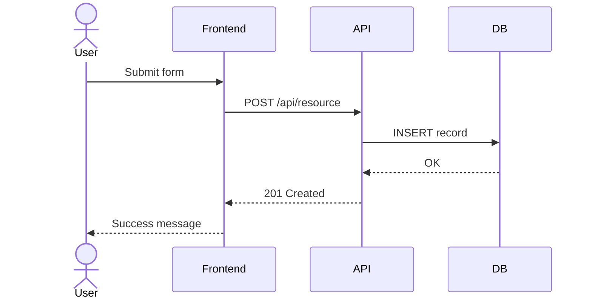

# Visual Spec Package: [Project Name]

<!-- Complete visual design artifacts — fill before proceeding to implementation -->
<!-- Created by: visual-specs.skill | Date: [date] -->
<!-- Depends on: Approved PRD (S01) -->

---

## 1. System Architecture

### 1.1 C4 Context Diagram
<!-- High-level: system boundary, external actors, neighboring systems -->
<!-- Use Mermaid for simple (<15 nodes), Excalidraw for complex -->

**Diagram file**: [path to .excalidraw / .drawio or Mermaid below]

### 1.2 C4 Container Diagram (if multi-service)
<!-- Internal containers: services, databases, message queues, etc. -->

**Diagram file**: [path or Mermaid below]

### 1.3 C4 Component Diagram (if complex service)
<!-- Internal components within a single container -->

**Diagram file**: [path or Mermaid below]

---

## 2. Workflow & State Diagrams

### 2.1 Primary User Flow
<!-- Main happy-path workflow from user action to system response -->

**Diagram file**: [path or Mermaid below]

### 2.2 State Machine: [Entity Name]
<!-- For entities with >3 states — orders, payments, sessions, etc. -->

**Diagram file**: [path or Mermaid below]

### 2.3 Additional Workflows
<!-- Error flows, admin flows, batch processes, etc. -->

---

## 3. UI/UX Design

### 3.1 Key Screen Wireframes
<!-- Use tldraw for wireframes, Figma for high-fidelity -->

| Screen | Wireframe File | Description |
|---|---|---|
| [Login] | [path/to/login.tldr] | [Email/password form, OAuth buttons] |
| [Dashboard] | [path/to/dashboard.tldr] | [Summary cards, recent activity] |
| [Detail Page] | [path/to/detail.tldr] | [Entity details, edit form, actions] |

### 3.2 Screen Flow / Navigation
<!-- How screens connect — page navigation map -->

**Diagram file**: [path or Mermaid below]

### 3.3 Component Hierarchy
<!-- Reusable UI components and their nesting -->

---

## 4. Data Model

### 4.1 ER Diagram
<!-- Entity-Relationship model for persistent storage -->

**Diagram file**: [path or Mermaid below]

### 4.2 Data Flow
<!-- How data moves through the system — input → processing → storage → output -->

---

## 5. Use Cases & Interactions

### 5.1 Sequence Diagram: [Primary Use Case]
<!-- Actor-system interaction for the main flow -->

**Diagram file**: [path or Mermaid below]

### 5.2 Additional Use Cases
<!-- Error scenarios, admin use cases, batch operations -->

---

## 6. Visual Input Log

<!-- Track all original visual inputs and their recognition results -->

| # | Input Image | Type | Recognition Result | Output Diagram | Confidence |
|---|---|---|---|---|---|
| 1 | [path/to/whiteboard.jpg] | Architecture | [Recognized N nodes, M edges] | [path/to/arch.excalidraw] | [HIGH/MED/LOW] |
| 2 | [path/to/wireframe.jpg] | UI Wireframe | [Recognized N elements] | [path/to/screens.tldr] | [HIGH/MED/LOW] |
| 3 | [path/to/flowchart.jpg] | Flowchart | [Recognized N steps, M decisions] | [Mermaid in Section 2] | [HIGH/MED/LOW] |

---

## 7. Design Readiness Checklist

**All required items must pass before proceeding to S02 Architecture / S03 Implementation.**

### Required
- [ ] System architecture diagram (C4 Context minimum) — present and human-verified
- [ ] Primary user workflow diagrammed (flowchart/sequence)
- [ ] Data model / ER diagram documented (if persistent storage involved)
- [ ] All user-provided visual inputs processed and documented in Section 6
- [ ] All diagrams committed to version control

### Recommended (for UI-facing projects)
- [ ] UI wireframes for key screens created (tldraw/Figma)
- [ ] Screen flow / navigation diagram present
- [ ] Component hierarchy documented

### Optional (for complex systems)
- [ ] State diagrams for entities with >3 states
- [ ] Sequence diagrams for cross-service interactions
- [ ] Deployment / infrastructure diagram
- [ ] Use case diagram for actor-system boundaries

### Approval
| Role | Name | Status | Date |
|---|---|---|---|
| Product | [name] | [APPROVED / PENDING] | [date] |
| Engineering | [name] | [APPROVED / PENDING] | [date] |
| Design | [name] | [APPROVED / PENDING] | [date] |

**Human approval required before proceeding to Architecture/Implementation phase.**
