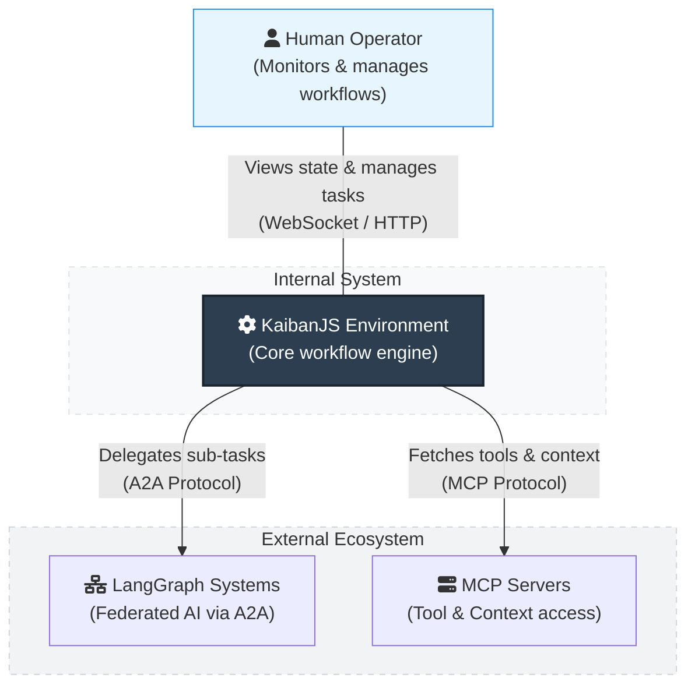

# Architecture Plan (PLAN.md)
## System Architecture & C4 Diagrams

### 1. System Context Diagram

### 2. Container Diagram

### 3. Component Hierarchy (Internal Node.js Layout)
- `src/infrastructure/messaging/`
  - `interfaces.ts`: Base interfaces for Drivers
  - `bullmq-driver.ts`: Implementation using BullMQ & Redis.
  - `kafka-driver.ts`: Implementation using KafkaJS.
- `src/adapters/state/`
  - `distributedMiddleware.ts`: Zustand interceptor publishing state deltas.
  - `agent-state-publisher.ts`: Direct Redis pub/sub; 15s heartbeat; lifecycle.
- `src/application/actor/`
  - `AgentActor.ts`: Encapsulation of a single KaibanJS agent with local task queue processing.
- `src/infrastructure/federation/`
  - `a2a-connector.ts`: Generates AgentCards and handles JSON-RPC.
  - `mcp-client.ts`: Integrates existing MCP servers securely.
