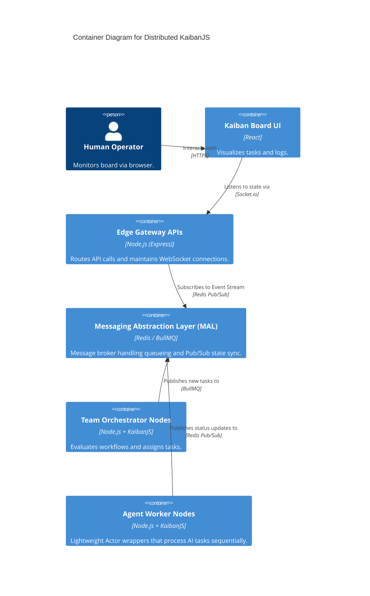

# Architecture Plan (PLAN.md)
## System Architecture & C4 Diagrams

### 1. System Context Diagram
```mermaid
C4Context
    title System Context for Distributed KaibanJS
    Person(user, "Human Operator", "Monitors and manages workflows via Kaiban Board.")
    System(kaibanjs, "KaibanJS Environment", "Core workflow engine where AI agents execute tasks.")
    SystemExt(langgraph, "External AI Systems (LangGraph)", "Federated external AI networks communicating via A2A.")
    SystemExt(mcp, "MCP Servers", "External Model Context Protocol servers providing tool access.")

    Rel(user, kaibanjs, "Views state & manages tasks using", "WebSocket / HTTP")
    Rel(kaibanjs, langgraph, "Delegates sub-tasks using", "A2A Protocol")
    Rel(kaibanjs, mcp, "Fetches tools and context using", "MCP Protocol")
```

### 2. Container Diagram


### 3. Component Hierarchy (Internal Node.js Layout)
- `core/messaging`
  - `interfaces.ts`: Base interfaces for Drivers
  - `bullmq-driver.ts`: Implementation using BullMQ & Redis.
- `core/state`
  - `distributedMiddleware.ts`: Zustand interceptor publishing state deltas.
- `core/actor`
  - `AgentActor.ts`: Encapsulation of a single KaibanJS agent with local task queue processing.
- `core/federation`
  - `a2a-connector.ts`: Generates AgentCards and handles JSON-RPC.
  - `mcp-client.ts`: Integrates existing MCP servers securely.
